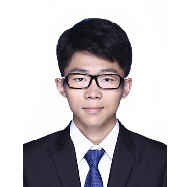

## 关于我

 
Hi! 我目前在[MEGVII(Face++)](https://www.megvii.com)北京研究院担任视觉算法研究员。

## 研究方向
我的研究兴趣包括计算机视觉和深度学习，尤其是视觉场景感知领域，如物体检测、物体跟踪、场景语义分割与全景分割。

## 最新进展

[2019/03] 我的论文 OANet 被计算机视觉顶会 **CVPR2019** 接受。

[2018/09] 作为 Megvii(Face++)-R4D Team 团队成员之一，我们赢得了国际权威比赛 2018 COCO Panoptic Segmentation and Mapillary Panoptic Segmentation **1st place** 的成绩。

## 竞赛 & 项目

[No.1 of COCO 2018 Challenge in Panoptic Segmentation Track 2018](http://cocodataset.org/workshop/coco-mapillary-eccv-2018.html)

[No.1 of Mapillary 2018 Challenge in Panoptic Segmentation Track 2018](http://cocodataset.org/workshop/coco-mapillary-eccv-2018.html)

## 学术成果

[An End-to-End Network for Panoptic Segmentation](https://arxiv.org/abs/1903.05027).  
Computer Vision and Pattern Recognition (CVPR), 2019  
**Huanyu Liu**, Chao Peng, Changqian Yu, Jingbo Wang, Xu Liu, Gang Yu, Wei Jiang 

## 经历 & 活动

**算法研究员**, 旷视科技北京研究院检测组. 2019-04 ~ 现在

**算法实习生**, 旷视科技北京研究院检测组. 2018-06 ~ 2019-04

**算法实习生**, 图森科技. 2017-07 ~ 2017-10

**联合创始人**, 浙江大学学生AI协会(ZJU-AI Club). 2017-11 ~ 2018-06

**主席**, 浙江大学学生物联网技术俱乐部(ZJU-IOT Club). 2016-11 ~ 2017-11

**学术研究生**, 浙江大学智能与控制研究所. 2016-11 ~ 2017-11

**开发实习生**, 巨迪科技机器人业务部. 2016-06 ~ 2016-09

**本科生**, 浙江大学控制科学与工程学院. 2012-09 ~ 2016-06